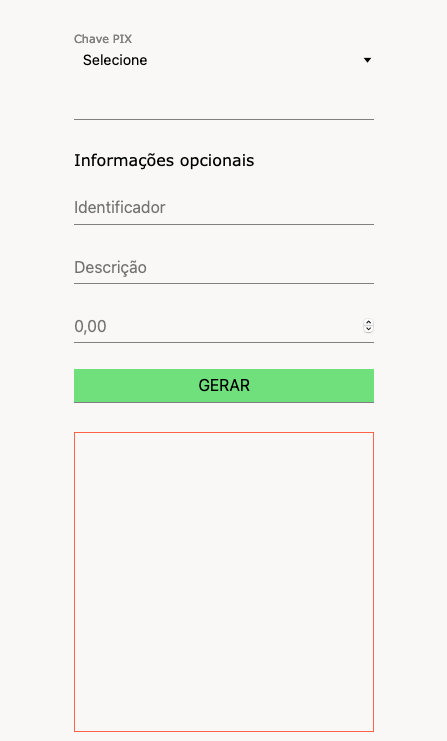

<p align="center">
	

  

  

  <a href="https://github.com/alejuliao">
    
  </a>
</p>


## 💻 Sobre o projeto


- É uma aplicação que gera QRCode/Código para pagamento via PIX de acordo com a chave escolhida.

- Projeto realizada com o javascript e outras tecnologias front end.


---


# Gerador QRCode Pix
 
 - Gerar QRCode estático paga pagamento bancário via Pix em JavaScript.
 - Utilizado padrão QRCode fornecido pelo Banco Central
 - Gerador de QRCode Utilizado. - [QRCodeJS](https://github.com/davidshimjs/qrcodejs) 
## Layout
<p align="center">
  
</p>

---

## 🚀 Como executar o projeto

### Pré-requisitos

Antes de começar, você vai precisar ter instalado em sua máquina as seguintes ferramentas:
[Git](https://git-scm.com).
Além disto é bom ter um editor para trabalhar com o código como [VSCode](https://code.visualstudio.com/)

#### 🧭 Rodando a aplicação

```bash

# Clone este repositório
$ git clone git@github.com:alejuliao/gerador-pix-estatico.git

# Acesse a pasta do projeto no seu terminal/cmd
$ cd gerador-pix-estatico

# Abra o arquivo index.html no seu navegador padrão e preencha
# as informações, ao clicar em GERAR será criado seu QRCode para 
# ser utilizado, ou a linha de código para pagamento via Pix de qualquer banco.

```

---

## Autor

<a href="https://github.com/alejuliao">
 
 <br />
 <sub><b>Alexandre Julião</b></sub>
</a>
<br />

[](https://www.linkedin.com/in/alexandrejuliao/)

---

## 📝 Licença

Este projeto esta sobe a licença [MIT](./LICENSE).

Feito com Alexandre Julião 👋 [Entre em contato!](https://www.linkedin.com/in/alexandrejuliao/)
